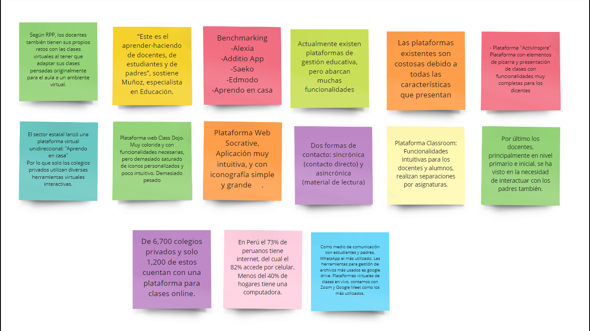
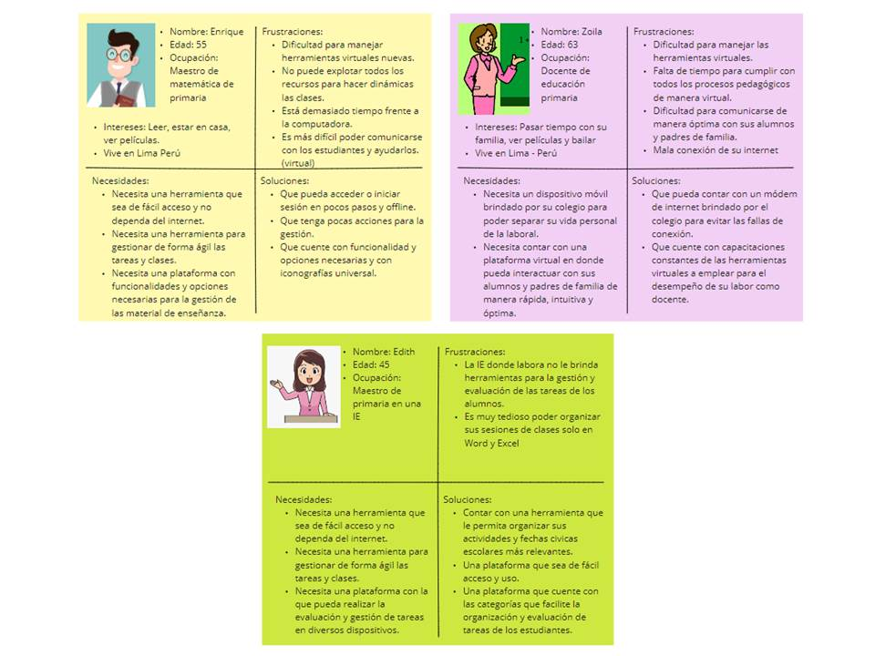
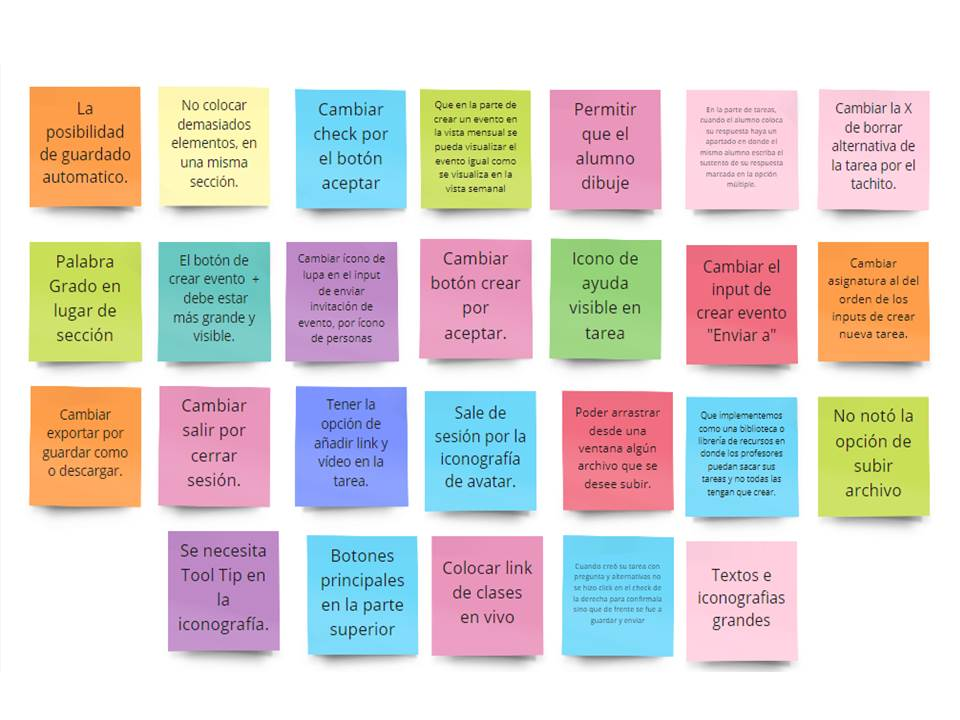

# Facilito

## Preámbulo

En Perú, debido a la pandemia, todas las entidades educativas deben realizar sus sesiones virtuales. Por lo que muchas instituciones educativas usan diversas plataforma virtuales, para trabajar sus metodología de trabajo y realizar las clases en vivo.

A muchos docentes se les ha dificultado la migración a esta forma de trabajo, generando diversos inconvenientes con la interacción de las plataformas virtuales, entre ellos están: el desconocimiento del manejo de las herramientas, retraso en las clases virtuales, problemas con la señal de internet, entre otros.

Para entender mejor el contexto actual con respecto al desempeño de los docentes en las clases virtuales, se realizó una investigación con respecto a cómo viven y lidian con esta nueva modalidad de enseñanza.

## Resumen del proyecto

Se pretende diseñar un propuesta de plataforma virtual, que sea accesible e intuitiva a los docentes del sector educativo primario. 

## Problemática

### Problema a solucionar:

¿Cómo podríamos rediseñar la experiencia educativa remota para los docentes entre 45 y 65 años, del nivel primario para que su interacción con las herramientas pedagógicas de planificación virtuales sea intuitiva y cómoda?

### Objetivos:
Objetivo general
* Diseñar una plataforma educativa que permita la gestión y planificación de clases para docentes del nivel primario.

Objetivos específicos:
* Crear una plataforma educativa intuitiva, pensando en el usuario.
* Determinar las principales necesidades del usuario e integrarlas en la plataforma.
* Crear una interfaz amigable para el usuario.

## Investigación UX:
[Desarrollo del proyecto](https://miro.com/app/board/o9J_kkqvhQM=/)

Para realizar el presente proyecto, se tomó en cuenta el proceso de diseño de la metodología Design Thinking.
### Empatizar

#### Product research
Para analizar el mercado y plataformas existentes, se realizó un benchmarking con los principales competidores. 
* Alexia
* Additio App
* Edmodo
* Aprendo en casa
* Socrative

#### User research
Para descubrir insights de las perspectivas de los usuarios, se procedió a realizar una investigación cualitativa, para lo cuál se elaboró una [guía de entrevistas](https://docs.google.com/document/d/12z27AUkap4gzTWGOrbGAbelZ4EAZLNISORewaj4JyhM/edit)

Investigación cualitativa: 

Método empleado: Entrevistas 
Medios de comunicación utilizados: Videollamadas (Zoom, Whatsapp) y presencial.
Evidencias: audios, fotos, videos.
Entrevistados:
* Laura Elizabeth Balboa Albitres
* María Zoila Guzmán Dávalos
* Lucho Merino Palomino
* Jeanette Motta Támara

### Síntesis y definición
Luego de realizar las entrevistas a los diversos usuarios, se analizó los hallazgos y se centró toda la información. En este sentido, se procedió a identificar los puntos de dolor y necesidades de nuestro público objetivo.

Principales Frustraciones: 
* A los usuarios les resulta difícil poder crear las tareas para los alumnos. 
* Los usuarios sienten que la mayoría de las plataformas que utilizan no están diseñadas para personas mayores, lo cual dificulta el maneja de estas.

Necesidades: 
* Los docentes necesitan estructurar las tareas para los alumnos de una manera rápida y sencilla.
* Los docentes requieren planificar reuniones y eventos importantes con otros docentes y padres de familia.
* Los docentes necesitan manejar la lista de los estudiantes de los diversos grados y secciones que enseñan.

Herramientas empleadas:
* Brainstorming

* Personas (arquetipos)

### Ideación 
Al poder conocer la problemática de los usuarios, se realizó una lluvia de ideas para plantear la solución más idónea para los usuarios. 
Herramientas empleadas: 
* Brainstorming 
* Mapa mental
* Casos de uso

Luego de realizar el análisis respectivo, se planteó el diseño de una plataforma educativa dirigida para docentes mayores del nivel primario que cuente con opciones que le permita planificar y gestionar sus clases de manera práctica.  

### Prototipado
Creación de prototipo

[Prototipo de baja fidelidad](https://www.figma.com/proto/Kkkqul3H8CcVUs2LlH5ewe/Mind-Blank?node-id=0%3A1)

[Prototipo de alta fidelidad](https://www.figma.com/proto/elL8K3OMhcDqgl5GVereGX/Mind-Blank---AF?node-id=0%3A1&scaling=min-zoom)

### Testeo
#### Test de usabilidad
Se iteró el prototipo de baja fidelidad con 5 usuarios. Gracias a ello, se encontrarón diversos hallazgos, con respecto diseño y navegación de la plataforma.

Hallazgos:
* La interfaz no deben tener mucha carga cognitiva.
* La iconografía debe ser universal y sólida.
* La redación debe ser clara y concisa para el usuario.
* Incluir una guía de navegación en toda la plataforma para los usuarios nuevos.
* La plataforma debe tener opciones dinámicas cuando el usuario estructure las tareas.

### Resultados:

### Prototipos de baja fidelidad:

### Prototipos de alta fidelidad:
